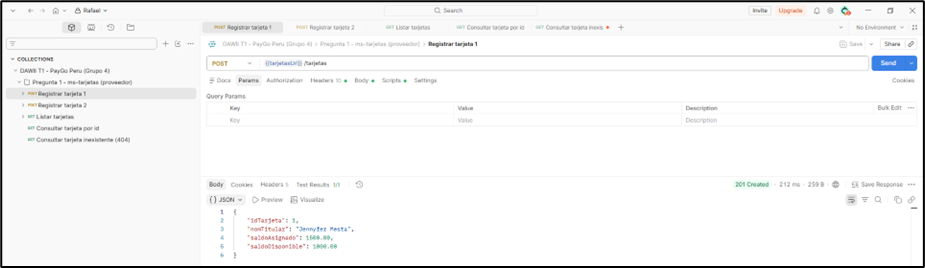
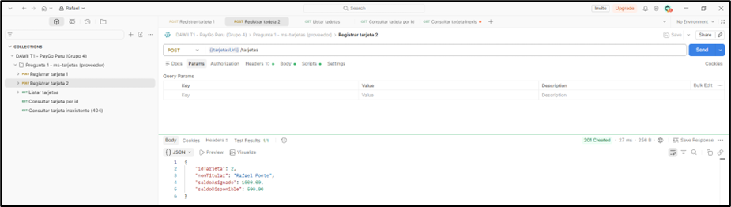
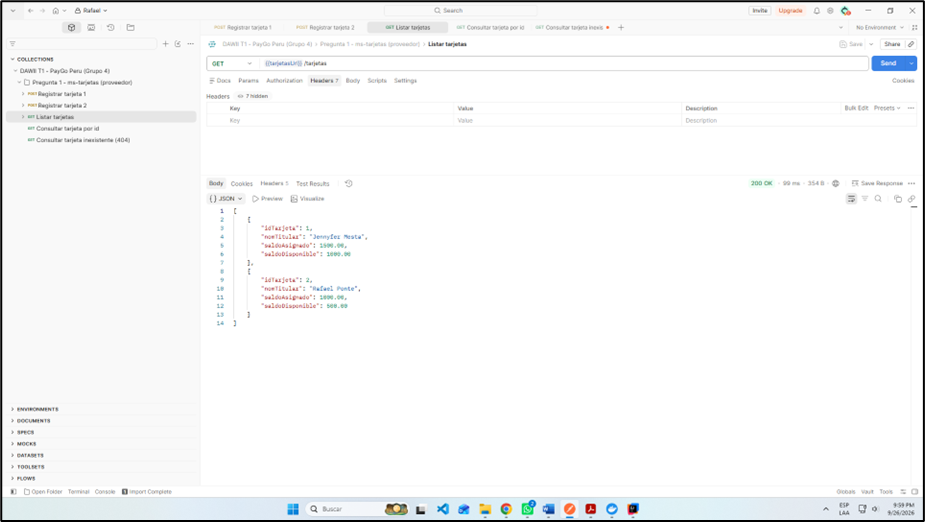
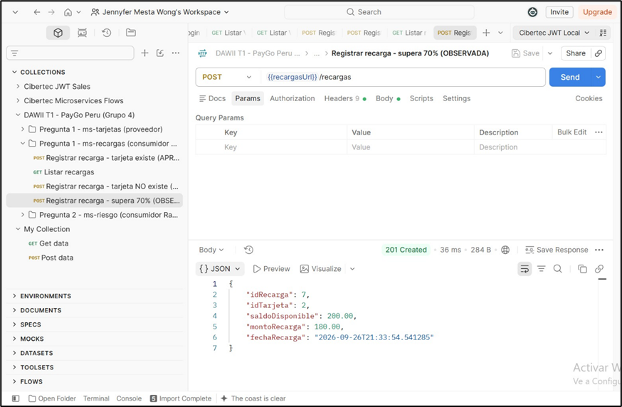
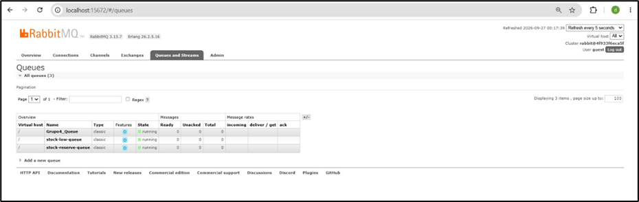

# DAWII T1 -- GRUPO 4

## PAYGO PERÚ

**Evaluación de Laboratorio T1 -- Desarrollo de Aplicaciones Web II**

CIBERTEC -- 2026

### INTEGRANTES

- Marcelo Manrique Bellido
- Daniel Jose Mendivil Chipana
- Jennyfer Allison Mesta Wong
- Franklin Molina Jimenez
- Rafael Anderson Ponte Gaitan

---

## 1. DESCRIPCIÓN DEL PROYECTO

El presente proyecto corresponde a la evaluación T1 del curso Desarrollo de Aplicaciones Web II.

El proyecto consiste en desarrollar una solución basada en microservicios para la empresa ficticia PAYGO PERÚ, la cual trabaja con tarjetas prepago y recargas.

Para realizar la comunicación entre los diferentes servicios se utilizaron dos formas de comunicación:

- Comunicación síncrona utilizando OpenFeign.
- Comunicación asíncrona utilizando RabbitMQ.

Los principales microservicios desarrollados son:

- ms-tarjetas
- ms-recargas
- ms-riesgo

---

## 2. ARQUITECTURA DEL PROYECTO

El proyecto está organizado en tres microservicios principales.

**ms-tarjetas:**
Se encarga del registro y consulta de las tarjetas.

**ms-recargas:**
Se encarga de registrar las recargas y realizar la validación de la tarjeta mediante OpenFeign. Luego de registrar una recarga, envía la información mediante RabbitMQ.

**ms-riesgo:**
Recibe la información de las recargas mediante RabbitMQ, realiza la evaluación correspondiente y registra el resultado del análisis.

**Flujo general:**

```
ms-recargas
    |
    | OpenFeign
    v
ms-tarjetas

ms-recargas
    |
    | RabbitMQ
    v
Grupo4_Queue
    |
    v
ms-riesgo
    |
    v
tabla analisis
```

---

## 3. MICROSERVICIO MS-TARJETAS

**Puerto utilizado:** 8084

Este microservicio permite registrar y consultar las tarjetas utilizadas por el sistema.

La información se almacena en la tabla `tarjetas`.

**Campos principales:**

- id_tarjeta
- nom_titular
- saldo_asignado
- saldo_disponible

**Endpoints utilizados:**

| Método | Endpoint | Descripción |
|---|---|---|
| POST | `/tarjetas` | Permite registrar una nueva tarjeta. |
| GET | `/tarjetas` | Permite obtener el listado de tarjetas registradas. |
| GET | `/tarjetas/{id}` | Permite consultar una tarjeta por su identificador. |

---

## 4. MICROSERVICIO MS-RECARGAS

**Puerto utilizado:** 8085

Este microservicio se encarga de registrar las solicitudes de recarga.

Antes de registrar una recarga, se realiza una consulta al microservicio ms-tarjetas utilizando OpenFeign. De esta manera se puede comprobar si la tarjeta existe y obtener su saldo disponible.

**Endpoints utilizados:**

| Método | Endpoint | Descripción |
|---|---|---|
| POST | `/recargas` | Permite registrar una nueva recarga. |
| GET | `/recargas` | Permite consultar todas las recargas registradas. |
| GET | `/recargas/{id}` | Permite consultar una recarga específica. |

**Ejemplo de solicitud:**

```json
{
  "idTarjeta": 1,
  "montoRecarga": 500.00
}
```

**Pasos al registrar una recarga:**

1. Se recibe la solicitud de recarga.
2. ms-recargas consulta a ms-tarjetas utilizando OpenFeign.
3. Se verifica que la tarjeta exista.
4. Se obtiene el saldo disponible de la tarjeta.
5. Se registra la recarga en la base de datos.
6. Se genera el evento de la recarga.
7. El evento se envía mediante RabbitMQ.

---

## 5. COMUNICACIÓN CON OPENFEIGN

Para la comunicación entre ms-recargas y ms-tarjetas se utilizó OpenFeign.

El objetivo es que ms-recargas pueda consultar información de una tarjeta sin acceder directamente a la base de datos del otro microservicio.

**El flujo utilizado es:**

```
ms-recargas → OpenFeign → ms-tarjetas
```

Por ejemplo, cuando se realiza una recarga, ms-recargas consulta:

```
GET /tarjetas/{id}
```

Si la tarjeta existe, se obtiene la información necesaria para continuar con el registro de la recarga.

Si la tarjeta no existe, la recarga no se registra y se devuelve el error correspondiente.

---

## 6. COMUNICACIÓN ASÍNCRONA CON RABBITMQ

Después de registrar una recarga, ms-recargas envía la información del evento utilizando RabbitMQ.

**Para esto se utiliza:**

- **Exchange:** `recargas-exchange`
- **Routing Key:** `recarga.registrada`
- **Queue:** `Grupo4_Queue`

**El flujo es:**

```
ms-recargas
    ↓
recargas-exchange
    ↓
recarga.registrada
    ↓
Grupo4_Queue
    ↓
ms-riesgo
```

Esta comunicación permite que ms-recargas pueda enviar la información de la recarga sin tener que esperar directamente la respuesta de ms-riesgo.

---

## 7. MICROSERVICIO MS-RIESGO

**Puerto utilizado:** 8086

El microservicio ms-riesgo recibe los eventos enviados desde ms-recargas mediante RabbitMQ.

Cuando recibe una recarga, realiza una evaluación tomando como referencia el 70% del saldo disponible.

**Reglas utilizadas:**

- **APROBADA:** Si el monto de la recarga es menor o igual al 70% del saldo disponible.
- **OBSERVADA:** Si el monto de la recarga es mayor al 70% del saldo disponible.

**Ejemplo:**

- Saldo disponible: 800.00
- 70% del saldo: `800 × 0.70 = 560.00`
- Si la recarga es de 500.00: `500 <= 560` → Resultado: **APROBADA**

**Otro ejemplo:**

- Saldo disponible: 200.00
- 70% del saldo: `200 × 0.70 = 140.00`
- Si la recarga es de 180.00: `180 > 140` → Resultado: **OBSERVADA**

---

## 8. TABLA ANALISIS

El resultado de la evaluación realizada por ms-riesgo se registra en la tabla `analisis`.

**Los principales datos registrados son:**

- id_recarga
- id_tarjeta
- saldo_disponible
- monto_recarga
- fecha_recarga
- situacion

**La situación puede ser:**

- APROBADA
- OBSERVADA

---

## 9. ENDPOINT DEL MICROSERVICIO MS-RIESGO

```
GET /analisis
```

Este endpoint permite consultar los análisis registrados después de procesar las recargas.

Con este endpoint se puede verificar si las recargas fueron clasificadas como APROBADAS u OBSERVADAS.

---

## 10. TECNOLOGÍAS UTILIZADAS

Para el desarrollo del proyecto se utilizaron las siguientes tecnologías:

- Java
- Spring Boot
- Spring Web
- Spring Data JPA
- OpenFeign
- RabbitMQ
- MySQL
- Gradle
- Docker
- Postman
- Git y GitHub

---

## 11. INFRAESTRUCTURA

Para ejecutar el proyecto se utiliza Docker para levantar los servicios necesarios.

**Entre los componentes utilizados se encuentran:**

- Base de datos MySQL
- RabbitMQ
- phpMyAdmin

RabbitMQ permite administrar los exchanges, queues y mensajes utilizados para la comunicación entre los microservicios.

---

## 12. EJECUCIÓN DEL PROYECTO

Para ejecutar el proyecto primero se debe tener Docker Desktop iniciado.

Luego se levantan los servicios necesarios para la base de datos y RabbitMQ.

**Después se ejecutan los microservicios:**

- ms-tarjetas -- puerto 8084
- ms-recargas -- puerto 8085
- ms-riesgo -- puerto 8086

Una vez levantados los servicios, se pueden realizar las pruebas utilizando Postman.

---

## 13. PRUEBAS CON POSTMAN

Las pruebas del proyecto se realizaron utilizando Postman.

**Entre las pruebas realizadas se encuentran:**

- Registro de una tarjeta.
- Consulta de tarjetas.
- Registro de una recarga.
- Consulta de una recarga.
- Validación de una tarjeta existente.
- Validación de una tarjeta inexistente.
- Envío del evento de recarga mediante RabbitMQ.
- Recepción del evento en ms-riesgo.
- Consulta de los análisis realizados.

---

## 14. CASOS DE PRUEBA

### Caso 1 -- Recarga aprobada

- Tarjeta: 1
- Saldo disponible: 800.00
- Monto de recarga: 500.00
- 70% del saldo: 560.00
- **Resultado esperado:** APROBADA.

### Caso 2 -- Recarga observada

- Tarjeta: 2
- Saldo disponible: 200.00
- Monto de recarga: 180.00
- 70% del saldo: 140.00
- **Resultado esperado:** OBSERVADA.

### Caso 3 -- Tarjeta inexistente

- Tarjeta: 999
- **Resultado esperado:** La tarjeta no existe y la recarga no debe registrarse.

---

## 15. EVIDENCIAS

En esta sección se colocarán las capturas de las pruebas realizadas.

**Servicio Tarjetas:**

### Registro





### Listado



### Consulta por Id


### Consulta por Id cuando no existe un registro


**Servicio Recargas:**

### Registrar recargas


### Listar recargas


### Registrar recarga cuando tarjeta no existe


### Registrar recarga cuando supera el 70%


### Docker Desktop


### Rabbit



**Servicio Riesgos:**

### Listar análisis


---

## 16. CONCLUSIÓN

Con el desarrollo de este proyecto se logró implementar la comunicación entre los diferentes microservicios utilizando OpenFeign y RabbitMQ.

OpenFeign permitió realizar la comunicación directa entre ms-recargas y ms-tarjetas para validar la información de las tarjetas.

Por otro lado, RabbitMQ permitió enviar de manera asíncrona la información de las recargas hacia ms-riesgo.

Finalmente, ms-riesgo realiza la evaluación de cada recarga utilizando la regla del 70% y registra el resultado en la tabla analisis.

El proyecto también permitió realizar pruebas utilizando Postman y verificar el funcionamiento de los microservicios mediante las evidencias obtenidas durante la ejecución.